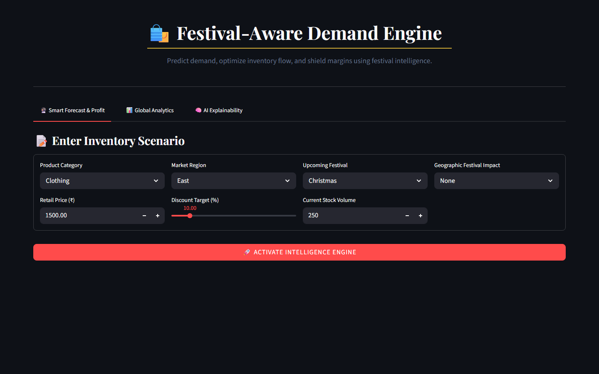
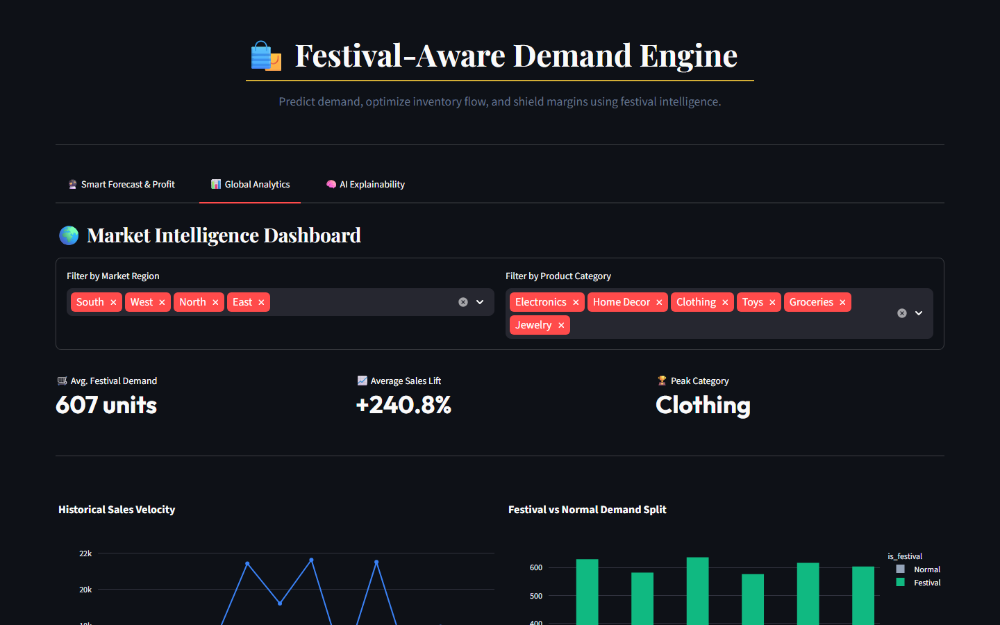
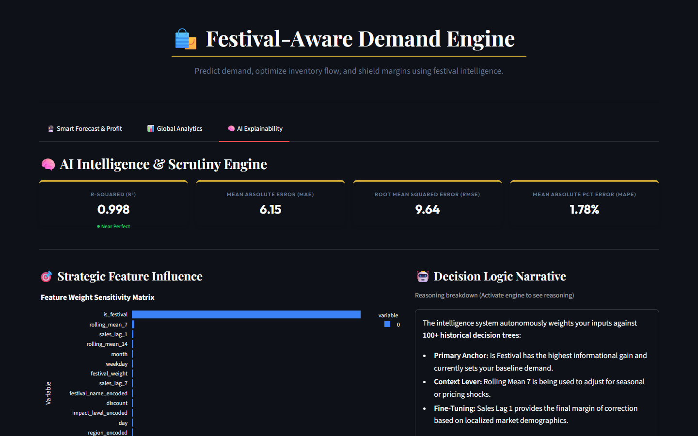

# 🏛️ DemandSense AI: Premium Retail Intelligence

[](https://www.python.org/)
[](https://streamlit.io/)
[](https://xgboost.readthedocs.io/)
[](https://fonts.google.com/specimen/Playfair+Display)

**DemandSense AI**, developed by **alok rana**, is an executive-grade business intelligence platform designed to transform traditional retail into data-driven powerhouses. Built with a bespoke **"Modern & Royal"** aesthetic, it leverages sophisticated festival-aware machine learning to master demand forecasting and profit optimization.

---

## 🖼️ Visual Outcomes (The Royal Experience)

> [!NOTE]
> Below are the definitive high-resolution captures of the DemandSense AI ecosystem in its "Royal Gold" configuration.

### 1. 🔮 The Intelligence Engine (Main Dashboard)
*High-density KPIs and 7-day precision forecasting with theme-aware inventory risk alerts.*


### 2. 🌍 Global Market Insights
*Interactive heatmaps and seasonal velocity trends exploring demand across Indian regions.*


### 3. 🧠 AI Scrutiny Engine (Explainability)
*Total decision transparency through Feature Sensitivity Matrices and Model Health KPIs.*


---

## 📂 Project Architecture

```text
DemandSense-AI/
├── 📂 data/                   # Historical Market Datasets (CSV)
├── 📂 model/                  # Trained AI Engine & Encoders
├── 📄 app.py                  # Core 'Royal' Intelligence Dashboard
├── 📄 train_model.py          # XGBoost Training & Pipeline Logic
├── 📄 requirements.txt        # Production-Grade Dependencies
└── 📄 README.md               # Executive Documentation
```

---

## 💎 The Strategic Pillars

### 1. 🔮 Execution Engine (Precision Forecasting)
At the heart of DemandSense is a festival-aware XGBoost engine. It doesn't just predict numbers; it understands the cultural pulse of the Indian market—autonomously weighting festivals like Diwali, Holi, and Eid to prevent stockouts during peak surges.

### 2. ⚖️ Financial Intelligence & Strategy Simulator
Go beyond simple predictions. Use the **AI 'What-If' Simulator** to test alternate business strategies.
- **Demand Elasticity:** Automatically simulates how discounts will boost volume.
- **Margin Scrutiny:** Real-time calculation of Expected Revenue vs. Inventory Entry Costs.
- **Risk Vectors:** Instant visualization of potential depreciation from overstock.

### 3. 🌍 Market Intelligence Dashboard
A dedicated Business Intelligence (BI) suite that explores historical data through interactive heatmaps and seasonal velocity charts. Filter by **Region** and **Category** to uncover hidden market opportunities.

### 4. 🧠 AI Scrutiny (Explainability)
Total transparency for executive decision-making. The Scrutiny Engine provides:
- **Executive Top-Bar:** High-level Model Health KPIs (R², MAE, RMSE) with a gold-leaf finish.
- **Feature Sensitivity Matrix:** Visualizes exactly which factors (Price, Festival, Region) are driving the current forecast.
- **Decision Logic Narrative:** A human-readable breakdown of the AI's internal reasoning.

---

## 🎨 Design Philosophy: "Modern & Royal"

DemandSense AI is built for the executive office. It features:
- **Typography:** Authority and elegance through **Playfair Display** (Serif) and **Outfit** (Sans-serif).
- **Color Palette:** A sophisticated mix of **Imperial Navy**, **Champagne Gold**, and **Slate Grey**.
- **Responsive Aesthetics:** Full dark-mode compatibility with theme-aware CSS variables that maintain lead-grade readability in any environment.

---

## 🛠️ Technology Stack

- **Core Intelligence:** Python 3.9+ / XGBoost v2.0
- **Data Architecture:** Scikit-Learn (Label Encoding & Pipeline) / Pandas / NumPy
- **Strategic UI:** Streamlit Premium
- **Interactive Visuals:** Plotly Executive Suite
- **Aesthetic Engine:** Custom CSS Injection with Google Fonts API

---

## 🚀 Deployment Guide

### 1. Setup Environment
```bash
pip install -r requirements.txt
```

### 2. Synthesize AI Engine
Train the historical model to initialize the intelligence baseline:
```bash
python train_model.py
```

### 3. Command the Dashboard
Launch the high-end interface:
```bash
streamlit run app.py
```

---

## 🎯 Executive Workflow

1.  **Configure:** Input product parameters and upcoming festival events.
2.  **Simulate:** Use the 'What-If' simulator to find the optimal stock/discount balance.
3.  **Analyze:** Scrutinize the AI's reasoning through the Explainability tab.
4.  **Execute:** Act on real-time reorder and depreciation alerts.

---

### 🏆 The Impact
DemandSense AI eliminates the "Guesswork Gap" in retail. It empowers retailers to achieve **Optimal Stock Alignment**, drastically reducing unsold waste while maximizing profit during India's most vibrant commercial periods.

---
*Architected with Excellence by **alok rana**.*
